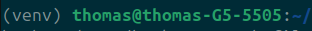
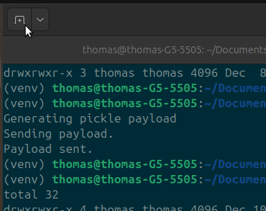
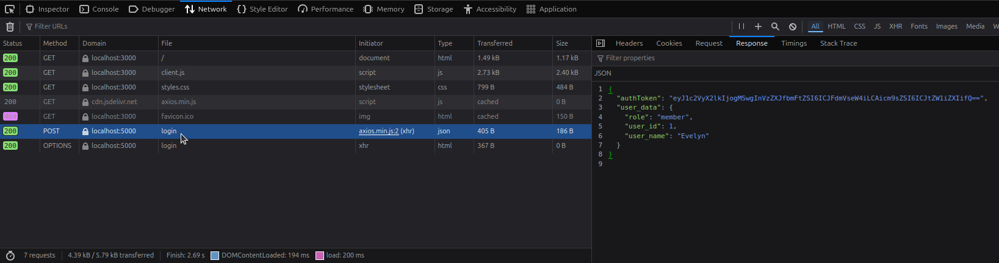

# Docker Deserialization Attack Lab

A dockerized simulation of two critical vulnerabilities when passing authorization tokens. Using a mock web service we simulate two types of attacks on a backend server, utilizing exploits in the way the server handles untrusted inputs. Finally, we have a secure version that eliminates the vulnerabilities presented by both insecure examples. 

A technical report on the vulnerabilites and remediation stategies can be found in the [Security Report](Security_Report.pdf). 

# Table of Contents
- [Docker Deserialization Attack Lab](#docker-deserialization-attack-lab)
- [Table of Contents](#table-of-contents)
- [Pre-Requisites](#pre-requisites)
  - [Ubuntu](#ubuntu)
  - [Firefox](#firefox)
  - [Docker](#docker)
  - [Python Virtual Environment (venv)](#python-virtual-environment-venv)
- [Webservice](#webservice)
- [Example 1: Remote Code Execution](#example-1-remote-code-execution)
  - [The Python Pickle](#the-python-pickle)
  - [Insecure Serialization](#insecure-serialization)
  - [Running the Lab](#running-the-lab)
  - [Impact](#impact)
  - [Mitigation](#mitigation)
- [Example 2: Privelege Escalation](#example-2-privelege-escalation)
  - [Running the Lab](#running-the-lab-1)
  - [Impact](#impact-1)
  - [Mitigation](#mitigation-1)
- [Example 3. Secure Tokens](#example-3-secure-tokens)
  - [Running the Lab](#running-the-lab-2)
  - [Impact](#impact-2)
- [Technology Stack](#technology-stack)


# Pre-Requisites

## Ubuntu

This simulation is verified to work on:

Ubuntu 24.04 LTS

## Firefox

While this simulation should work on any web browser, this was only tested on Firefox.

## Docker

This uses dockerized containers to simulate a webserver's frontend and backend.

### Offical Guide

The official guide to installing docker can be found here: [Install Docker](https://docs.docker.com/engine/install/ubuntu/#install-using-the-repository).  
A quick install guide is shown below.

### 1. Setup Apt Repository

```bash
# Add Docker's official GPG key:
sudo apt update
sudo apt install ca-certificates curl
sudo install -m 0755 -d /etc/apt/keyrings
sudo curl -fsSL https://download.docker.com/linux/ubuntu/gpg -o /etc/apt/keyrings/docker.asc
sudo chmod a+r /etc/apt/keyrings/docker.asc

# Add the repository to Apt sources:
sudo tee /etc/apt/sources.list.d/docker.sources <<EOF
Types: deb
URIs: https://download.docker.com/linux/ubuntu
Suites: $(. /etc/os-release && echo "${UBUNTU_CODENAME:-$VERSION_CODENAME}")
Components: stable
Signed-By: /etc/apt/keyrings/docker.asc
EOF

sudo apt update
```

### 2. Install Docker Packages

```bash
sudo apt install docker-ce docker-ce-cli containerd.io docker-buildx-plugin docker-compose-plugin
```

### 3. Check Status

```bash
sudo systemctl status docker
```

### 3.1 Start if Disabled

```bash
sudo systemctl start docker
```

## Python Virtual Environment (venv)

The scripts that showcase the vulnerabilites in secure serilziation are best used with a virtual environment.

### 1. Create Python Venv

Make sure you're in the base dir of the project.

```bash
python3 -m venv venv
```

### 2. Activate Virtual Environment

Activate the virtual environment.

```bash
source venv/bin/activate
```

### 3. Install requirements.txt

Install the packages and libraries required for the the project to run.

```bash
pip install -r requirements.txt
```

# Webservice

While not required for the lab, once the containers are up and running you can access the website by going to [localhost:3000](http://localhost:3000).

Here you can confirm that only those with admin access will triggger the admin panel. It is specifically looking for a response from the webserver authorizing the user to have admin privileges.

This minimal setup showcases a simple stateless implementation of authentication and authorization. This is common for web services as it allows for the reduction in user lookup and authorization for every action. 

# Example 1: Remote Code Execution

## The Python Pickle

The python pickle library is a notriously insecure method of serializing objects. Its own documentation page warns users of the dangers when unpickling data.

## Insecure Serialization

This lab simualates an attacker utilizing the vulnerability of the python pickle package to serialize a class that automatically runs itself when unserialized. [OWASP A08:2017](https://owasp.org/www-project-top-ten/2017/A8_2017-Insecure_Deserialization) shows that this is a often hard to identify this is as a security flaw as it is not as obvious as other flaws.

Taking advantage of this vulnerability often requires knowledge of the process of the backend server in utilizing the serialized data. This exploit however is a critical weakness, as the potential of Remote Code Execution allows for an attacker to gain complete access to a resource.

## Running the Lab

A few important things before running the lab.

The python exploit scripts must be run from a terminal that has the python virtual environment activated. 



This can only be done from the root folder of the project, so I would recommend you keep a terminal open for the exploit scripts since you'll have to activate the venv for any new terminal.

Docker doesn't require it, so the terminal that you currently have open should have the venv already active, click on the plus icon on the top left to open a new terminal session in the same directory. This will be the terminal you use for the docker container.



I will refer to them as the venv terminal and the docker terminal.

### 1. Move into insecure_deserialization

Using the docker terminal. 

```bash
cd insecure_deserialization
```

### 2. Build the Docker Containers

Using the docker terminal.

```bash
docker compose up --build
```

This will start the frontend and backend server. This simulates a skeleton website with a login and an option to access an "admin panel".

### 2.1 Open the website (optional)

While not required for the lab, you can access the website by going to [localhost:3000](http://localhost:3000).

### 3.1 Confirm Absence of Attacker Artifact

Using the venv terminal, move into the server directory and confirm that the files and dir contained within.

```bash
cd insecure_deserialization
ls -l
```


### 3.2 Run Attack Script

Using the venv terminal, move back into the root of the insecure_deserialization lab folder.

```bash
cd ..
```

Run the attack script.

```bash
python pickle_bomb.py
```

This will serialize a python class that has the __reduce__ property. Upon deserialization the pickle library will automatically run the commands contained within this property before any checks can be made against the data contained.

The script then sends this malicious package to the backend webserver through the publicly visible web address contained in client.js.

### 4. Confirm Remote Code Execution

Still in the venv terminal, after execution, move into the server directory. This is the backend logic of the micro-service, analogous to the backend service in a real life web service.

```bash
cd insecure_deserialization
ls -l 
```

This should show a file called "unwelcome_guest.txt" that should not be in this directory. The pickle bomb successfully created a file on the server.


You can now close this terminal window and return to the terminal running the **docker compose**.

### 5. Stop the Containers

In the docker terminal, press ```ctrl + c``` to stop the micro-services. 

That is the end of this portion of the lab.

## Impact

This attack lab showcases the danger of using insecure libraries for deserializing data from an inherently untrusted source. A library such as the python pickle should never be used to transport data from outside the trust boundary.  

Doing so opens critical components to malicous actors, this example shows the danger of **Remote Code Execution**, allowing an attacker to run abitrary code on the box. 

In the example we created a file, in a real world scenario (and depending on the permissions granted to the server), an attacker could wipe out the entire machine.

## Mitigation

The solution is to not use serialize data using inherently insecure protocols. Moving away from the python pickle library to JSON is a solid first step.

The inherent vulnerability in this set-up however, blindly trusting sources outside of the trust boundary, is a security flaw that is not solved by switching from an insecure serialziation method to a secure one. It exchanges one vulnerability for another.

# Example 2: Privelege Escalation

In this set-up, we have moved away from using the python pickle to completely using json for the Authorization Token. However, we are still blindly trusting the client without verifying any of the information they are sending us. 

This is a security vulnerability in of itself, as we are relying on the Authorization Token to identify who this user is and what their role is.

## Running the Lab

### 1. Move into the broken_access_control directory

Using the docker terminal, which should still be in the ```insecure_deserialization``` directory, move into the ```broken_access_control``` directory.

```bash
cd ../broken_access_control
```

### 2. Build the Docker Containers

Using the docker terminal.

```bash
docker compose up --build
```

The setup is the same except for the Flask App (the server) having been updated to not use the pickle library anymore.

### 3.1 Open the website

For this lab we are intentionally modifying the Authentication Token that we receive from the webserver. While you are not required to copy the Authorization Token, it is important to see that this is an artifact that the client receives from the web server.

This token is what identifies and authorizes the user's actions in the eyes of the server.

Open [localhost:3000](http://localhost:3000).

### 3.2 Open the Browser's Developer Tools

Press ```F12``` to open the developer tools on the mock website.

### 3.3 View Network Activity

Open the network tab on the developer toolbar and click on ```reload``.


This allows us to view the requests being sent back and forth between the client and the server. This is all easily accessible information and it is important to keep in mind when creating solutions, that nothing can be truly hidden from the client.

### 3.4 View Authorization Token

For this part of the simulation, we will be using the user ```Evelyn``` as they are just a member. 

Click on the ```Log in: Evelyn``` button to login and receive Evelyn's Authorization Token.

In the Network tab you should see the ```POST``` request for the login. Clicking on it will allow you to view the response to the request. This response will contain the Authorization Token for Evelyn, along with her ```user_data``` that the client.js uses to populate the fields.



### 3.5 Copy the Authorization Token (optional)

While not required, you can copy and use the Authorization Token here and use it for ```privilege_escalation.py``` if you would like. The script itself, when not provided with a token will attempt to find one for ```user_id = 1``` (Evelyn), whose role is a member and thus cannot access the admin panel.

### 4.1 Move venv Terminal 

Using the venv terminal, we're going to move to the same directory.

```bash
cd ../broken_access_control
```

### 4.2 Run privilege_escalation.py

Run ```privilege_escalation.py`` with or without the token from step 3.5.

```bash
python privilege_escalation.py
```

or with token

```bash
python privilege_escalation.py <token>
```

This will showcase how, since the server blindly trusts all incoming data, we can easily modify the Authorization Token to escalate a non-admin user to admin.

### 5. Stop the Containers

In the terminal running the docker compose, press ```ctrl + c``` to stop the micro-services. 

That is the end of this portion of the lab.

## Impact

Assuming you ran this either without a token or with Evelyn's token (there would be no point in running this with Thomas' token since he is already an admin), the script will first show how trying to access the ```access_admin``` route on the webserver will return ```is_elevated : False``` as Evelyn is not an admin.

The script will then decode the JSON, since it is not encrypted, and then modifies the role from ```member``` to ```admin```. It then encodes the JSON, attaches it to the headers for a request and then retry the same route. 

The server now returns ```is_elevated : True```. An attacker has now successfully elevated a non-admin user to admin. In a stateless design, this is especially dangerous as this Authorization token with adminstrative priveleges completely bypasses any authentication and verification that may have occured when the user logs in.

Broken Access Controls is the number 1 on the most recent [OWASP Top 10 (2021)](https://owasp.org/Top10/2021/A01_2021-Broken_Access_Control/) list, its is a serious security flaw that as demonstrated, can lead to unauthrozied users gaining access to potentially sensitive or critical systems.

## Mitigation

The easiest way to secure an Authorization Token, which also extends to any information originating from the server and must remain unmodified, is to utilize some form of cryptography.

The simplest solution, and one we use here, is to attach an Hash-Based Message Authentication Code (HMAC) to the Authorization Token.


# Example 3. Secure Tokens

In this set-up, we've realized that blindly trusting a source from beyond our trust boundary is inherently risky. We now create a signature of our original Authorization Token using a secret key only we know, we then send these together as the new Signed Authorization Token.

Server side we now only accept Authorization Tokens that contain a signature. We then compute a new signature using the INCOMING encoded data part of this Authorization Token, we then compare that to signature attached to the AuthorizationToken. This is to verify that the information contained within the encoded data section of the Authorization Token has not been modified, since an attacker would not be able to create the same signature without our secret key.


## Running the Lab

### 1. Move into the broken_access_control directory

Using the docker terminal in the ```broken_access_control``` directory, move into the ```secure_app``` directory.

```bash
cd ../secure_app
```

### 2. Build the Docker Containers

Using the docker terminal.

```bash
docker compose up --build
```

In this setup, the backend server has been upgraded to now create hmac signatures and attachign them to the authorization tokens. The server will reject any request for admin permissions if the authorization token is missing a signature or the signature doesn't match the messsage.

### 3.1 Open the website

For this lab we are going to attempt to modify the Signed Authentication Token that we receive from the webserver. While you are not required to copy the Signed Authorization Token, it is important to see that this is an artifact that the client receives from the web server, and how now it has a signature attached to the end.

Open [localhost:3000](http://localhost:3000).

### 3.2 Open the Browser's Developer Tools

Press ```F12``` to open the developer tools on the mock website.

### 3.3 View Network Activity

Open the network tab on the developer toolbar and click on ```reload``.


This allows us to view the requests being sent back and forth between the client and the server. This is all easily accessible information and it is important to keep in mind when creating solutions, that nothing can be truly hidden from the client.

### 3.4 View Authorization Token

For this part of the simulation, we will continue to use the user ```Evelyn``` as they are just a member. 

Click on the ```Log in: Evelyn``` button to login and receive Evelyn's Signed Authorization Token.

In the Network tab you should see the ```POST``` request for the login. Clicking on it will allow you to view the response to the request. This response will contain the Signed Authorization Token for Evelyn, along with her ```user_data``` that the client.js uses to populate the fields.


### 3.5 Copy the Authorization Token (optional)

While not required, you can copy and use the Authorization Token here and use it for ```privilege_escalation.py``` if you would like. The script itself, when not provided with a token will attempt to find one for ```user_id = 1``` (Evelyn), whose role is a member and thus cannot access the admin panel.

### 4.1 Move venv Terminal

Move the venv terminal to the same directory.

```bash
cd ../secure_app
```

### 4.2 Run privilege_escalation.py

Using the venv terminal, run ```privilege_escalation.py`` with or without the token from step 3.5.

```bash
python privilege_escalation.py
```

or with token

```bash
python privilege_escalation.py <token>
```

This will show that with the newly signed token, we are unable to get the server to escalate our role. In fact, we get an Error 403 Forbidden since the server itself realizes that the data has been tampered with and will refuse to interact with any data that is attached to this token.

You can now close this terminal.

### 5. Stop the Containers

In the docker terminal, press ```ctrl + c``` to stop the micro-services. 

That is the end of this portion of the lab.

## Impact

With the introduction of a signed authorization token, we've now protected our stateless system from malicious actors seeking to gain access through this specific avenue.

For the user, nothing has changed. In fact, clien.js required no modification of code once it was complete, since it simply accepts the Authorization Token, stores it, and then attaches it to as a request header going forward. The client doesn't care what it is, yet on the backend we've now ensured that our server is hardened against some of the most common attacks.

# Technology Stack

Python (Flask), Node.js (Express), Docker, Axios
