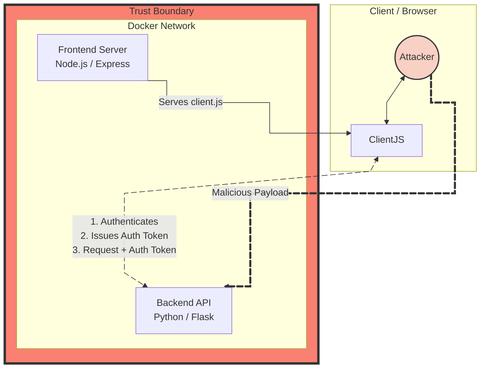
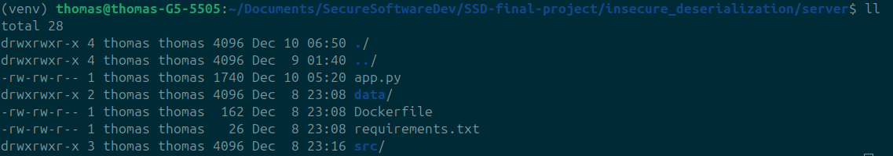
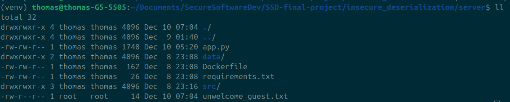
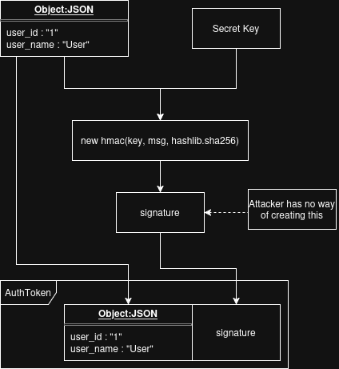
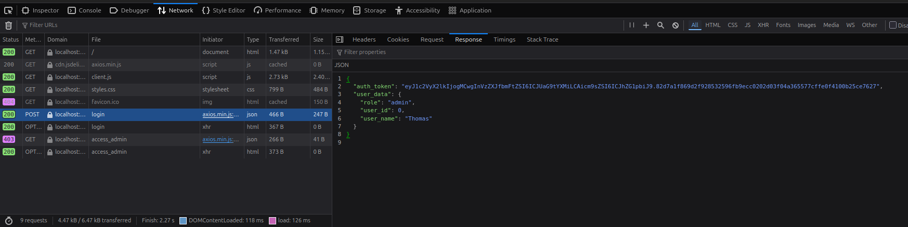

# Docker Deserialization Attack Lab

A dockerized simulation of two critical vulnerabilities when passing authorization tokens. Using a mock web service we simulate two types of attacks on a backend server, utilizing exploits in the way the server handles untrusted inputs. Finally, we have a secure version that eliminates the vulnerabilities presented by both insecure examples. 

A technical report on the vulnerabilities and remediation strategies can be found in the [Security Report](Security_Report.pdf). 

# Technology Stack

Python (Flask), Node.js (Express), Docker, Axios




# Table of Contents
- [Docker Deserialization Attack Lab](#docker-deserialization-attack-lab)
- [Technology Stack](#technology-stack)
- [Table of Contents](#table-of-contents)
- [Pre-Requisites](#pre-requisites)
- [Quick Set-up](#quick-set-up)
- [Webservice](#webservice)
- [Attack Vector](#attack-vector)
- [Example 1: Remote Code Execution](#example-1-remote-code-execution)
  - [Running the Lab](#running-the-lab)
  - [Impact](#impact)
  - [Mitigation](#mitigation)
- [Example 2: Privilege Escalation](#example-2-privilege-escalation)
  - [Running the Lab](#running-the-lab-1)
  - [Impact](#impact-1)
  - [Mitigation](#mitigation-1)
- [Example 3 Secure Tokens](#example-3-secure-tokens)
  - [Running the Lab](#running-the-lab-2)
  - [Impact](#impact-2)


# Pre-Requisites

Tested to work on: 
- Ubuntu 24.04.4 LTS
- Docker version 29.2.1

The official guide to installing docker can be found here: [Install Docker](https://docs.docker.com/engine/install/ubuntu/#install-using-the-repository).  
## Python Virtual Environment (venv)

# Quick Set-up

This will clone the repo and set up the required venv for the project.

```bash
git clone https://github.com/ThomasBakaysaJr/dockerized-rce-simulation.git insecure-lab
cd insecure-lab
python3 -m venv venv
source venv/bin/activate
pip install -r requirements.txt
```

# Webservice

While not required for the lab, once the containers are up and running you can access the website by going to [localhost:3000](http://localhost:3000). You can change this by modifying the .env file.


Here you can confirm that only those with admin access will trigger the admin panel. It is specifically looking for a response from the webserver authorizing the user to have admin privileges.

This minimal setup showcases a simple stateless implementation of authentication and authorization. This is common for web services as it allows for the reduction in user lookup and authorization for every action. 

# Attack Vector

Since the intensive process of authentication is done once in a stateless system, with subsequent authorization handled by the auth token, this very token becomes an high-value target for malicious actors. A server must never trust incoming data. The risk from data outside the trust boundary ranges from minimal to catastrophic.

# Example 1: Remote Code Execution

## The Python Pickle

The python pickle library is a notoriously insecure method of serializing objects. Its own documentation page warns users of the dangers when unpickling data.

## Insecure Serialization

This lab simulates an attacker utilizing the vulnerability of the python pickle package to serialize a class that automatically runs itself when unserialized. [OWASP A08:2017](https://owasp.org/www-project-top-ten/2017/A8_2017-Insecure_Deserialization) shows that this is a often hard to identify this is as a security flaw as it is not as obvious as other flaws.

Exploiting this vulnerability often requires knowledge of the process of the backend server in utilizing the serialized data. This exploit however is a critical weakness, as the potential of Remote Code Execution allows for an attacker to gain complete access to a resource.

## Running the Lab

### 1 Build Insecure Serialization Docker Containers

```bash
cd insecure_deserialization
docker compose up --build -d
```

### 2 Open the website (optional)

While not required for the lab, you can access the website by going to [localhost:3000](http://localhost:3000).

### 3 Confirm Absence of Attacker Artifact

The server directory is clean and contains only the files required for the server to run.



### 4 Run Attack Script

Run the python pickle_bomb script to attack the backend server.

```bash
python pickle_bomb.py
```

This will serialize a python class that has the __reduce__ property. Upon deserialization the pickle library will automatically run the commands contained within this property before any checks can be made against the data contained.

The script then sends this malicious package to the backend webserver through the publicly visible web address contained in client.js.

### 5 Confirm Remote Code Execution

Inside the server directory, a new file called "unwelcome_guest.txt" now exists. The pickle bomb successfully created a file on the server.



## Impact

This attack lab showcases the danger of using insecure libraries for deserializing data from an inherently untrusted source. A library such as the python pickle should never be used to transport data from outside the trust boundary.  

Doing so opens critical components to malicious actors, this example shows the danger of **Remote Code Execution**, allowing an attacker to run arbitrary code on the box. 

In the example we created a file. In a real world scenario (and depending on the permissions granted to the server), an attacker could wipe out the entire machine.

## Mitigation

The solution is to not use serialized data using inherently insecure protocols. Moving from the python pickle library to JSON is a solid first step.

The inherent vulnerability in this set-up however, blindly trusting sources outside of the trust boundary, is a security flaw that is not solved by switching from an insecure serialization method to a secure one. It exchanges one vulnerability for another.

# Example 2: Privilege Escalation

In this set-up, we have moved away from using the python pickle to completely using json for the Authorization Token. However, we are still blindly trusting the client without verifying any of the information they are sending us. 

This is a security vulnerability in of itself, as we are relying on the Authorization Token to identify who this user is and what their role is.

## Running the Lab

### 1 Tear down and build the next experiment

```bash
docker compose down
cd ../broken_access_control
docker compose up --build -d
```

### 2 Verify Auth Token (optional)

The setup is the same except for the Flask App (the server) having been updated to move away from using python pickling for the Authorization Token. Instead, we are encoding and sending JSON structures.

For this lab we are intentionally modifying the Authentication Token that we receive from the webserver. While you are not required to copy the Authorization Token, it is important to see that this is an artifact that the client receives from the web server.

This token is what identifies and authorizes the user's actions in the eyes of the server.

### 3 Run privilege_escalation.py

Run ```privilege_escalation.py`` with or without the auth token.

```bash
python privilege_escalation.py
```

or with token

```bash
python privilege_escalation.py <token>
```

This will showcase how, since the server blindly trusts all incoming data, we can easily modify the Authorization Token to escalate a non-admin user to admin.

## Impact

Assuming you ran this either without a token or with Evelyn's token (there would be no point in running this with Thomas' token since he is already an admin), the script will first show how trying to access the ```access_admin``` route on the webserver will return ```is_elevated : False``` as Evelyn is not an admin.

The script will then decode the JSON, since it is not encrypted, and then modifies the role from ```member``` to ```admin```. It then encodes the JSON, attaches it to the headers for a request and then retry the same route. 

The server now returns ```is_elevated : True```. An attacker has now successfully elevated a non-admin user to admin. In a stateless design, this is especially dangerous as this Authorization token with administrative privileges completely bypasses any authentication and verification that may have occurred when the user logs in.

Broken Access Controls is the number 1 on the most recent [OWASP Top 10 (2021)](https://owasp.org/Top10/2021/A01_2021-Broken_Access_Control/) list, its is a serious security flaw that as demonstrated, can lead to unauthorized users gaining access to potentially sensitive or critical systems.

## Mitigation

The easiest way to secure an Authorization Token, which also extends to any information originating from the server and must remain unmodified, is to utilize some form of cryptography.

The simplest solution, and one we use here, is to attach an Hash-Based Message Authentication Code (HMAC) to the Authorization Token. 


>**Warning:**  
>Never rely on your own cryptographic implementations. This was done specifically to showcase how a JWT nominally functions. Always use well maintained crypto libraries, such as [JWT TOKENS](https://www.jwt.io/introduction#when-to-use-json-web-tokens)




# Example 3 Secure Tokens

In this set-up, we've realized that blindly trusting a source from beyond our trust boundary is inherently risky. We now create a signature of our original Authorization Token using a secret key only we know, we then send these together as the new Signed Authorization Token.

Server side we now only accept Authorization Tokens that contain a signature. We then compute a new signature using the INCOMING encoded data part of this Authorization Token, we then compare that to the signature attached to the AuthorizationToken. This is to verify that the information contained within the encoded data section of the Authorization Token has not been modified, since an attacker would not be able to create the same signature without our secret key. 



## Running the Lab

### 1 Tear down and build the next experiment

```bash
docker compose down
cd ../secure_app
docker compose up --build -d
```

In this setup, the backend server has been upgraded to now create HMAC signatures and attach them to the authorization tokens. The server will reject any request for admin permissions if the authorization token is missing a signature or the signature doesn't match the message.

### 2 Verify Auth Token (optional)

For this lab we are going to attempt to modify the Signed Authentication Token that we receive from the webserver. While you are not required to copy the Signed Authorization Token, it is important to see that this is an artifact that the client receives from the web server, and how now it has a signature attached to the end.

### 3 Run privilege_escalation.py

Run ```privilege_escalation.py`` with or without the auth token.

```bash
python privilege_escalation.py
```

or with token

```bash
python privilege_escalation.py <token>
```

This will show that with the newly signed token, we are unable to get the server to escalate our role. In fact, we get an Error 403 Forbidden since the server itself realizes that the data has been tampered with and will refuse to interact with any data that is attached to this token.

### 4. Stop the Containers

This is end of all experiments. We can now close the docker containers.

```bash
docker compose down
```

## Impact

With the introduction of a signed authorization token, we've now protected our stateless system from malicious actors seeking to gain access through this specific avenue.

For the user, nothing has changed. In fact, client.js required no modification of code once it was complete, since it simply accepts the Authorization Token, stores it, and then attaches it to as a request header going forward. The client doesn't care what it is, yet on the backend we've now ensured that our server is hardened against some of the most common attacks.